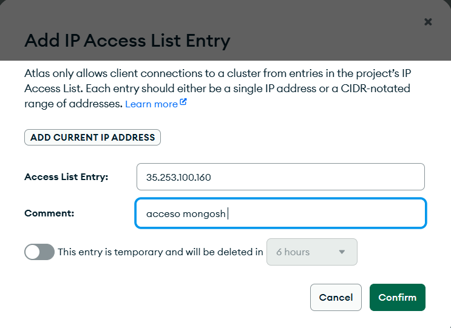

# Conectando a una Base de Datos MongoDB Usando el MongoDB Shell

**Última actualización:** 05 de octubre de 2026

Guía de estudio del módulo de MongoDB University sobre el uso del MongoDB Shell (mongosh) para conectarse a clústeres de MongoDB Atlas, solucionar errores de conexión y ejecutar operaciones de base de datos mediante JavaScript.

---

## Índice

- [Conceptos Clave](#conceptos-clave)
  - [Connection String](#connection-string)
  - [Formatos de Connection String](#formatos-de-connection-string)
  - [Componentes de una Connection String](#componentes-de-una-connection-string)
- [Instalación del MongoDB Shell (mongosh)](#instalación-del-mongodb-shell-mongosh)
  - [Instalación en Ubuntu](#instalación-en-ubuntu)
  - [Laboratorio: Instalar mongosh en Ubuntu](#laboratorio-instalar-mongosh-en-ubuntu)
- [Solución de Errores de Conexión](#solución-de-errores-de-conexión)
  - [Laboratorio: Solucionar Errores de Acceso a la Red](#laboratorio-solucionar-errores-de-acceso-a-la-red)
  - [Laboratorio: Solucionar Errores de Autenticación](#laboratorio-solucionar-errores-de-autenticación)
  - [Quiz de Sección](#quiz-de-sección)
- [Uso del MongoDB Shell](#uso-del-mongodb-shell)
  - [Insertar un Documento](#insertar-un-documento)
  - [Trabajando con JavaScript](#trabajando-con-javascript)
  - [Usando un Editor Externo](#usando-un-editor-externo)
- [Laboratorios: MongoDB Shell en Práctica](#laboratorios-mongodb-shell-en-práctica)
  - [Laboratorio: Insertar y Recuperar Documentos](#laboratorio-insertar-y-recuperar-documentos)
  - [Laboratorio: Ejecutar Funciones JavaScript](#laboratorio-ejecutar-funciones-javascript)
  - [Laboratorio: Cargar Scripts Externos](#laboratorio-cargar-scripts-externos)
  - [Laboratorio: Editar Comandos con Editor Externo](#laboratorio-editar-comandos-con-editor-externo)
  - [Quiz Final](#quiz-final)
- [Resumen del Módulo](#resumen-del-módulo)
- [Referencias y Fuentes](#referencias-y-fuentes)

---

## Conceptos Clave

### Connection String

Una **connection string** (cadena de conexión) es una cadena de texto que contiene toda la información necesaria para que un cliente o aplicación se conecte a una instancia de MongoDB. Funciona como un identificador único que le indica al driver o a la herramienta de conexión dónde encontrar el servidor de base de datos, qué credenciales utilizar y qué opciones de configuración aplicar durante la sesión.

En el contexto de MongoDB Atlas, la connection string es generada automáticamente por la plataforma y puede obtenerse desde el panel de control del clúster. Es fundamental mantenerla de forma segura, ya que contiene las credenciales de acceso a la base de datos. Nunca debe exponerse en repositorios públicos ni en código fuente sin mecanismos de protección como variables de entorno.

### Formatos de Connection String

MongoDB ofrece dos formatos para las cadenas de conexión:

- **Standard format (formato estándar):** Utilizado para conexiones directas a una instancia de MongoDB o a un conjunto de réplicas. Tiene la forma `mongodb://host:puerto`.

- **SRV format (formato SRV):** Es el formato recomendado y utilizado por defecto en MongoDB Atlas. Utiliza registros DNS de tipo SRV para resolver automáticamente los hosts del clúster. Tiene la forma `mongodb+srv://host`. La ventaja principal es que no requiere especificar los puertos ni las IPs individuales de cada nodo del clúster, ya que el DNS se encarga de resolverlos dinámicamente. Esto simplifica la configuración y hace más resiliente la conexión ante cambios en la infraestructura del clúster.

### Componentes de una Connection String

Una connection string consta de campos obligatorios y varios campos opcionales. Los campos opcionales se indican entre corchetes `[]` en la documentación oficial. Los componentes principales son:

- **Protocolo:** `mongodb://` o `mongodb+srv://`
- **Credenciales:** `username:password@`
- **Host:** dirección del servidor o del clúster
- **Puerto:** (solo en formato estándar) por defecto `27017`
- **Base de datos:** nombre de la base de datos a la que conectarse
- **Opciones:** parámetros adicionales como `authSource`, `tls`, `retryWrites`, etc.

---

## Instalación del MongoDB Shell (mongosh)

### Instalación en Ubuntu

El **MongoDB Shell** (`mongosh`) es una interfaz de línea de comandos interactiva y moderna para MongoDB. Está construido sobre Node.js y ofrece una interfaz completa para interactuar con bases de datos MongoDB, ya sean instancias locales o clústeres en la nube como MongoDB Atlas.

Entre sus principales características se encuentran:

- Soporte completo de JavaScript y ES6+
- Autocompletado de comandos y consultas
- Historial de comandos persistente entre sesiones
- Integración con editores de texto externos
- Capacidad de cargar y ejecutar scripts JavaScript

Para instalar `mongosh` en Ubuntu es necesario agregar el repositorio oficial de MongoDB al sistema de paquetes. El proceso completo se describe en el laboratorio a continuación.

Además de la instalación, se deben tener a la mano los siguientes elementos antes de intentar conectarse:

- La **connection string** del clúster de Atlas
- Las **credenciales de acceso** (usuario y contraseña del usuario de base de datos)

---

### Laboratorio: Instalar mongosh en Ubuntu

En este laboratorio se instala el MongoDB Shell en un entorno Ubuntu dentro de la plataforma de MongoDB University.

**Paso 1. Verificar que la dependencia `gnupg` esté instalada**

```bash
# Verificar la versión de GPG instalada en el sistema
gpg --version
```

**Paso 2. Importar la clave pública del repositorio de MongoDB**

```bash
# Descargar e importar la clave GPG pública de MongoDB 8.0
# wget -qO- descarga el contenido y lo pasa a tee para guardarlo en el directorio de claves confiadas
wget -qO- https://www.mongodb.org/static/pgp/server-8.0.asc | tee /etc/apt/trusted.gpg.d/server-8.0.asc
```

**Paso 3. Identificar la versión de Ubuntu**

```bash
# Ver los detalles de la versión del sistema operativo Ubuntu
# Se necesita el valor de VERSION_CODENAME para el siguiente paso
cat /etc/os-release
```

La salida esperada es similar a la siguiente:

```bash
PRETTY_NAME="Ubuntu 24.04.4 LTS"
NAME="Ubuntu"
VERSION_ID="24.04"
VERSION="24.04.4 LTS (Noble Numbat)"
VERSION_CODENAME=noble
ID=ubuntu
ID_LIKE=debian
```

En este ejemplo el codename es `noble`, correspondiente a Ubuntu 24.04.

**Paso 4. Crear el archivo de lista de repositorios de MongoDB**

```bash
# Crear el archivo .list que le indica a APT de dónde descargar los paquetes de MongoDB
# Reemplazar "noble" con el VERSION_CODENAME de tu sistema si es diferente
echo "deb [ arch=amd64,arm64 ] https://repo.mongodb.org/apt/ubuntu noble/mongodb-org/8.0 multiverse" | tee /etc/apt/sources.list.d/mongodb-org-8.0.list
```

**Paso 5. Actualizar el índice de paquetes e instalar mongosh**

```bash
# Actualizar el índice local de paquetes para incluir el repositorio de MongoDB
apt update

# Instalar el MongoDB Shell (-y acepta la instalación automáticamente)
apt install -y mongodb-mongosh
```

**Paso 6. Verificar la instalación**

```bash
# Confirmar que mongosh fue instalado correctamente mostrando su versión
mongosh --version
```

La salida esperada es la versión instalada, por ejemplo: `2.10.0`

---

## Solución de Errores de Conexión

Gran parte de los problemas que se generan al conectarse a MongoDB Atlas son causados por las restricciones de seguridad y los mecanismos de autenticación propios de la plataforma. Es importante conocer los tipos de errores más comunes para poder resolverlos de forma eficiente.

Los errores de conexión más frecuentes se dividen en dos categorías principales:

**1. Errores de acceso a la red (Network Access Errors):**
Ocurren cuando la dirección IP desde la que se intenta conectar no está en la lista de IPs permitidas del clúster. MongoDB Atlas implementa un control de acceso por IP similar a los grupos de seguridad en servicios de nube. Por defecto, ninguna IP externa tiene acceso, por lo que es necesario agregar explícitamente las IPs autorizadas desde la sección *Network Access* del panel de Atlas.

**2. Errores de autenticación (Authentication Errors):**
Se producen cuando las credenciales proporcionadas en la connection string son incorrectas o cuando el usuario especificado no existe en la lista de usuarios de la base de datos. Las contraseñas en MongoDB Atlas son sensibles a mayúsculas y minúsculas. Si el usuario no existe, es necesario crearlo desde la sección *Database Access* del panel de Atlas y asignarle los permisos adecuados.

**Otras causas comunes:**
- Los clústeres de Atlas tienen un límite máximo de conexiones simultáneas (hasta 500 en los niveles gratuitos y compartidos). Si se alcanza este límite, las nuevas conexiones serán rechazadas.
- Una conexión lenta o que no responde puede indicar que la IP no tiene acceso al clúster.

---

### Laboratorio: Solucionar Errores de Acceso a la Red

**Paso 1. Intentar conectarse al clúster**

```bash
# Intentar conectar al clúster de Atlas con las credenciales proporcionadas
# Este comando fallará intencionalmente si la IP no está en la lista de acceso
mongosh mongodb+srv://myatlasclusteredu.qrtz2fu.mongodb.net \
  --username myAtlasDBUser \
  --password myatlas-001
```

El error esperado es similar al siguiente (puede tardar hasta 30 segundos en aparecer):

```
MongoServerSelectionError: 4028A96250790000:error:0A000438:SSL routines:ssl3_read_bytes:
tlsv1 alert internal error. It looks like this is a MongoDB Atlas cluster.
Please ensure that your Network Access List allows connections from your IP.
```

Este error indica que la IP actual no tiene permisos para conectarse al clúster. La solución es agregar la IP en el panel de Atlas.

**Paso 2. Agregar la IP en el panel de Atlas**

Ir a la sección *Network Access* en el panel de control de Atlas, hacer clic en *Add IP Address* y pegar la dirección IP. Se recomienda marcar la opción para hacerla temporal si solo se necesita acceso durante el laboratorio.



Esperar a que el estado cambie de *Pending* a *Active* antes de continuar.

**Paso 3. Verificar la conexión exitosa**

```bash
# Intentar conectar nuevamente y ejecutar un ping de administración para confirmar el acceso
# --eval ejecuta el comando directamente sin abrir la shell interactiva
mongosh mongodb+srv://myatlasclusteredu.qrtz2fu.mongodb.net \
  --username myAtlasDBUser \
  --password myatlas-001 \
  --eval "db.adminCommand({ ping: 1 })"
```

Los argumentos del comando son:

- `mongosh`: inicia el cliente MongoDB Shell
- La URL de conexión: contiene la información del clúster en formato SRV
- `--username`: nombre del usuario de base de datos
- `--password`: contraseña del usuario
- `--eval`: ejecuta una expresión JavaScript y retorna el resultado sin abrir la sesión interactiva

---

### Laboratorio: Solucionar Errores de Autenticación

**Paso 1. Intentar conectarse con credenciales incorrectas**

```bash
# Intentar conectar con una contraseña incorrecta para reproducir el error de autenticación
mongosh mongodb+srv://myatlasclusteredu.qrtz2fu.mongodb.net \
  --username myAtlasDBUser \
  --password myatlas-001
```

El error esperado es:

```
MongoServerError: bad auth : authentication failed
```

**Paso 2. Actualizar la contraseña en Atlas**

Ir a la sección *Database Access* en el panel de Atlas, hacer clic en el botón *Edit* junto al usuario `myAtlasDBUser`, actualizar la contraseña y hacer clic en *Update User*. Esperar el mensaje de confirmación del despliegue.

**Paso 3. Reconectarse con las credenciales actualizadas**

```bash
# Conectar nuevamente con la contraseña correcta actualizada en el paso anterior
mongosh mongodb+srv://myatlasclusteredu.qrtz2fu.mongodb.net \
  --username myAtlasDBUser \
  --password myatlas-001
```

---

### Quiz de Sección

**Pregunta 1.** Al intentar conectarse al clúster de Atlas desde una nueva ubicación, se recibe el siguiente error:

```
MongoServerSelectionError: connection <monitor> to 34.239.188.169:27017 closed
```

*Respuesta correcta:* **Agregar la dirección IP actual en el panel de Network Access de Atlas.**

Para resolver un error de acceso a la red es necesario verificar el panel de *Network Access* en Atlas y confirmar que la IP actual está en la lista de acceso. Si no lo está, debe agregarse para obtener acceso al clúster.

---

**Pregunta 2.** Al intentar iniciar sesión con el usuario `atlasAdmin` se recibe el error:

```
MongoServerError: bad auth : Authentication failed.
```

*Respuesta correcta:* Los errores de autenticación pueden ocurrir por alguna de las siguientes razones:

- Las credenciales (usuario o contraseña) están escritas incorrectamente.
- El usuario especificado no existe en la lista de *Database Access* de Atlas.
- Se está intentando conectar al clúster incorrecto.

La solución es verificar que el usuario `atlasAdmin` exista en *Database Access* y tenga los permisos necesarios.

---

## Uso del MongoDB Shell

El MongoDB Shell es una herramienta poderosa que va más allá de ejecutar consultas simples. Permite realizar tareas complejas de administración y desarrollo directamente desde la línea de comandos, incluyendo:

- Insertar y recuperar documentos
- Escribir y ejecutar funciones JavaScript
- Cambiar entre múltiples bases de datos mediante scripts
- Cargar scripts externos con el método `load()`
- Editar comandos desde cualquier editor de texto externo

Dominar el uso del shell es fundamental para trabajar con MongoDB de forma eficiente, especialmente en entornos de desarrollo y administración.

---

### Insertar un Documento

Los dos comandos más básicos para trabajar con documentos en mongosh son:

- `insertOne()`: inserta un nuevo documento en una colección.
- `find()`: ejecuta una consulta y retorna los documentos que coincidan con los criterios especificados.

**Ejemplo: Consultar un documento con `find()`**

```javascript
// Buscar una película por su título en la colección "movies"
// El argumento es un objeto con el campo y el valor a buscar
db.movies.find({ title: 'Christmas Vacation' })
```

El método `find()` recibe un objeto de filtro con pares campo-valor encerrados en llaves `{}`. Retorna todos los documentos que coincidan con los criterios.

**Ejemplo: Insertar un documento con `insertOne()`**

```javascript
// Insertar un nuevo documento en la colección "movies"
// insertOne() recibe el documento completo como argumento
db.movies.insertOne(
  {
    title: 'Christmas Vacation',     // Título de la película
    cast: [
      "Chevy Chase", "D'Angelo", "Lewis"  // Lista de actores como array
    ],
    runtime: 97,                     // Duración en minutos
    rated: "PG-13",                  // Clasificación
    directors: [
      "John Hughes"                  // Directores como array
    ]
  }
)
```

La respuesta esperada al ejecutar `insertOne()` es:

```javascript
// MongoDB confirma la inserción y retorna el ObjectId generado automáticamente
{
  acknowledged: true,
  insertedIds: { '0': ObjectId('66b76987786b1f3a876876cx876') }
}
```

Una vez realizada la inserción, es posible verificarla ejecutando el comando `find()` nuevamente con el mismo filtro, lo que retornará el documento recién insertado con toda su información.

---

### Trabajando con JavaScript

El **MongoDB Shell** está construido sobre **Node.js**, lo que significa que es posible utilizar JavaScript moderno directamente en la sesión interactiva. Esto permite escribir lógica de programación compleja, incluyendo funciones, bucles, condicionales y manejo de errores.

**Ejemplo: Definir una función JavaScript en mongosh**

```javascript
// Definir una función que eleva un número al cubo
// Incluye validación del tipo de dato del argumento
function cube(number) {
  // Verificar que el argumento sea de tipo número antes de operar
  if (typeof number !== 'number') {
    throw new Error("Input must be a number");
  }
  // Retornar el resultado de elevar el número a la potencia 3
  return number ** 3;
}
```

Una vez pegada la función en la sesión de mongosh, MongoDB Shell la registra en el contexto global y confirma con la respuesta `[Function: cube]`. Esto indica que la función está disponible durante toda la sesión actual.

Para invocarla, basta con llamarla con el valor deseado:

```javascript
// Invocar la función cube con el valor 16
cube(16)
// Resultado esperado: 4096
```

Sin embargo, las funciones definidas directamente en una sesión de mongosh no persisten entre sesiones. Cada vez que se inicia una nueva sesión es necesario volver a definirlas o cargarlas desde un archivo externo.

**Ejemplo: Cambiar de base de datos y ejecutar una agregación**

```javascript
// Cambiar a la base de datos "sample_training" sin abrir una nueva conexión
// getSiblingDB() permite cambiar de base de datos dentro del mismo contexto de conexión
db = db.getSiblingDB("sample_training");

// Ejecutar una agregación para obtener un documento aleatorio de la colección "posts"
// $sample es un operador de agregación que retorna documentos de forma aleatoria
let result = db.posts.aggregate(
  {
    $sample: { size: 1 },  // Retornar 1 documento aleatorio
  }
);

// Imprimir el campo "body" del documento obtenido
print(result.next().body)
```

El operador `$sample` de la etapa de agregación selecciona aleatoriamente el número de documentos indicado. Las funciones de agregación permiten limpiar, filtrar y transformar los datos antes de retornarlos, un tema que se profundizará en módulos posteriores.

Para reutilizar estos scripts entre sesiones se utiliza el método `load()`, que carga y ejecuta un archivo JavaScript externo directamente en mongosh.

---

### Usando un Editor Externo

Cuando se trabaja con funciones o comandos complejos en mongosh, es conveniente utilizar un editor de texto externo en lugar de escribir directamente en la línea de comandos. El MongoDB Shell permite configurar un editor predeterminado mediante el objeto de configuración `config`.

**Verificar el editor actual:**

```javascript
// Consultar el editor de texto configurado actualmente en mongosh
// Retorna null si no hay ninguno configurado
config.get('editor')
```

**Configurar un editor externo:**

```javascript
// Establecer Vim como el editor de texto predeterminado para mongosh
// Se puede reemplazar 'vim' por 'nano', 'emacs' u otro editor disponible en el sistema
config.set('editor', 'vim')
```

**Abrir una función en el editor:**

```javascript
// Abrir la función "cube" en el editor configurado para modificarla
// El editor se abre con el código actual de la función
edit cube
```

Al guardar y cerrar el editor, los cambios se aplican inmediatamente en la sesión de mongosh.

---

## Laboratorios: MongoDB Shell en Práctica

### Laboratorio: Insertar y Recuperar Documentos

En este laboratorio se utiliza el MongoDB Shell para insertar un documento en la colección `movies` de la base de datos `sample_mflix` y luego recuperarlo con `find()`.

```javascript
// Insertar el documento de la película "Free Guy" en la colección movies
// La base de datos activa debe ser sample_mflix antes de ejecutar este comando
db.movies.insertOne({
  "plot": "When Guy, a bank teller, learns that he is a non-player character in a bloodthirsty, open-world video game, he goes on to become the hero of the story and takes the responsibility of saving the world.",
  "genres": ["Comedy", "Action", "Adventure"],    // Géneros de la película
  "runtime": 115,                                  // Duración en minutos
  "metacritic": 62,                                // Puntuación en Metacritic
  "rated": "PG-13",                                // Clasificación de edad
  "cast": ["Ryan Reynolds", "Jodie Comer", "Taika Waititi", "Joe Keery"],
  "poster": "https://a.media-amazon.com/images/I/81wVrggKq4L._SL1500_.jpg",
  "title": "Free Guy",                             // Título de la película
  "fullplot": "Brimming with optimism and positive energy, single bank teller Guy has spent nearly all his uneventful life wishing he were one of the cool people wearing sunglasses--people who run his town. But, one day, Guy has a chance encounter with mysterious Millie, the woman of his dreams, and just like that, he's on the brink of making an eye-opening, life-altering discovery. Now, to win her heart, all that Guy has to do is take control of his life, one step at a time. And then, out of the blue, Millie decides to drop a bombshell. However, is she telling the truth? Above all, if life is nothing but a game, what will it take for ordinary Guy to level up and get the girl?",
  "languages": ["English", "Japanese", "German"],
  "released": { "$date": "2021-08-13T00:00:00.000Z" },
  "directors": ["Shawn Levy"],
  "writers": ["Matt Lieberman", "Zak Penn"],
  "awards": { "wins": 1, "nominations": 9, "text": "1 win & 9 nominations." },
  "year": 2021,
  "imdb": { "rating": 7.1, "votes": 439000 },     // Datos de IMDB
  "countries": ["Canada", "USA"],
  "type": "movie",
  "num_mflix_comments": 0
})
```

Después de la inserción, verificar con `find()`:

```javascript
// Buscar el documento recién insertado para confirmar que se guardó correctamente
db.movies.find({ title: "Free Guy" })
```

---

### Laboratorio: Ejecutar Funciones JavaScript

En este laboratorio se demuestra la capacidad del MongoDB Shell para ejecutar funciones JavaScript que interactúan con la base de datos.

```javascript
// Definir una función de flecha que retorna un documento aleatorio de la colección movies
// aggregate() con $sample selecciona documentos de forma aleatoria
// toArray() convierte el cursor de resultado en un array de JavaScript
const randomMovie = () =>
  db.movies.aggregate([{ $sample: { size: 1 } }]).toArray();
```

Para invocarla y obtener una película aleatoria:

```javascript
// Ejecutar la función y obtener un documento aleatorio de la colección movies
randomMovie()
```

---

### Laboratorio: Cargar Scripts Externos

En este laboratorio se aprende a cargar y ejecutar archivos JavaScript externos desde el MongoDB Shell usando el método `load()`.

**Paso 1.** En el editor, abrir el archivo `/lab/connectAndInsert.js` y agregar en la línea 2 la selección de base de datos:

```javascript
// Seleccionar la base de datos sample_analytics como contexto activo
// getSiblingDB() cambia la base de datos sin cerrar la conexión actual
db = db.getSiblingDB("sample_analytics")
```

**Paso 2.** En la línea 38, reemplazar el código existente para imprimir el resultado:

```javascript
// Imprimir el resultado de la operación insertMany() en la consola de mongosh
// print() es el método integrado de mongosh para mostrar salida en la terminal
print(result)
```

**Paso 3.** En la sesión de mongosh, cargar y ejecutar el script:

```javascript
// Cargar el archivo JavaScript externo y ejecutarlo inmediatamente en mongosh
// El argumento es la ruta absoluta al archivo entre comillas
load("/lab/connectAndInsert.js")
```

La salida esperada muestra los ObjectIds de los documentos insertados:

```javascript
// Resultado de la operación insertMany: confirmación y ObjectIds generados
{
  acknowledged: true,
  insertedIds: {
    '0': ObjectId('63b747ac6caf50c84843089a'),
    '1': ObjectId('63b747ace9f9c5ae45e08781'),
    '2': ObjectId('63b747ac76f08d239c0a2120')
  }
}
true
```

---

### Laboratorio: Editar Comandos con Editor Externo

En este laboratorio se aprende a utilizar el helper `edit` del MongoDB Shell para modificar comandos complejos con un editor de texto externo antes de ejecutarlos.

**Paso 1.** Verificar la configuración actual del editor:

```javascript
// Verificar si hay algún editor configurado actualmente
// Retorna null si no hay ninguno establecido
config.get("editor")
```

**Paso 2.** Configurar nano como editor predeterminado:

```javascript
// Establecer nano como el editor de texto predeterminado en mongosh
// También se puede usar vim u otro editor disponible en el sistema
config.set("editor", "nano")
```

**Paso 3.** Abrir el editor con el comando `edit` y pegar el siguiente comando:

```javascript
// Comando para actualizar un documento en la colección transactions
// $push agrega un nuevo elemento al array "transactions" del documento encontrado
db.transactions.updateOne(
  { account_id: 000000 }, // MODIFICAR este valor antes de ejecutar
  {
    $push: {
      transactions: {
        date: new Date(),                                       // Fecha actual
        amount: Math.floor(Math.random() * 1000),             // Monto aleatorio entre 0 y 999
        transaction_code: Math.random() < 0.5 ? "buy" : "sell", // Tipo de transacción aleatorio
        symbol: "test",
        price: "100.00",
        total: "1337.10",
      },
    },
  }
);
```

**Paso 4.** Cambiar el valor de `account_id` de `000000` a `443178`, guardar y salir del editor (`Ctrl + X`, luego `Y`, luego `Enter` en nano).

**Paso 5.** Presionar `Enter` para ejecutar el comando modificado. La salida esperada es:

```javascript
// Resultado de updateOne: confirma que se encontró y modificó 1 documento
{
  acknowledged: true,
  insertedId: null,
  matchedCount: 1,    // Se encontró 1 documento con account_id: 443178
  modifiedCount: 1,   // Se modificó 1 documento
  upsertedCount: 0
}
```

---

### Quiz Final

**Pregunta 1.** ¿Cuál de las siguientes opciones describe correctamente cómo se puede usar una función JavaScript dentro de una sesión del MongoDB Shell?

- **a. Escribir y llamar funciones JavaScript directamente en una sesión de mongosh.** (Correcto)
- b. Las funciones JavaScript solo pueden usarse si se escriben en un entorno de programación separado y se importan al MongoDB Shell. (Incorrecto)
- c. No es posible usar funciones JavaScript en el MongoDB Shell. (Incorrecto)
- **d. Cargar un archivo que contenga la función en el MongoDB Shell usando el método `load()`.** (Correcto)

---

**Pregunta 2.** Se escribió una función JavaScript en una sesión del MongoDB Shell y se desea editarla usando el editor Emacs. ¿Qué se debe hacer primero?

- a. Usar el comando `edit` seguido del nombre de la función para abrirla en Emacs. (Incorrecto: primero hay que configurar el editor)
- b. Reiniciar mongosh. (Incorrecto)
- c. Abrir Emacs, escribir una nueva versión de la función y pegarla de vuelta en la sesión de mongosh. (Incorrecto)
- **d. Establecer el editor de texto preferido usando el comando `config.set('editor', 'emacs')`.** (Correcto)

---

## Resumen del Módulo

En esta unidad se aprendió a:

- Definir una connection string y su función para conectarse a un clúster de MongoDB
- Localizar la connection string de un clúster en Atlas
- Identificar los componentes básicos de una connection string estándar
- Instalar el MongoDB Shell (mongosh)
- Conectarse a una instancia local de MongoDB mediante mongosh
- Conectarse a un clúster de Atlas mediante mongosh
- Solucionar errores de conexión de MongoDB Atlas
- Recuperar e insertar documentos usando mongosh
- Escribir y utilizar funciones JavaScript dentro de una sesión de mongosh
- Usar el método `db.getSiblingDB()` para cambiar de base de datos dentro de un script
- Usar el método `load()` para cargar y ejecutar un archivo JavaScript en mongosh
- Usar un editor externo dentro de mongosh

---

## Referencias y Fuentes

- [Atlas - Get Connection String](https://www.mongodb.com/docs/atlas/tutorial/connect-to-your-cluster/) - Guía oficial para obtener la connection string de un clúster de Atlas.
- [Connection Strings](https://www.mongodb.com/docs/manual/reference/connection-string/) - Documentación oficial sobre los formatos y componentes de las connection strings de MongoDB.
- [Install mongosh](https://www.mongodb.com/docs/mongodb-shell/install/) - Instrucciones oficiales de instalación del MongoDB Shell en distintos sistemas operativos.
- [Connect to a Deployment](https://www.mongodb.com/docs/mongodb-shell/connect/) - Documentación sobre cómo conectarse a distintos tipos de despliegues de MongoDB con mongosh.
- [MongoDB Shell Options](https://www.mongodb.com/docs/mongodb-shell/reference/options/) - Referencia completa de opciones de línea de comandos disponibles en mongosh.
- [Atlas - Troubleshoot Connection Issues](https://www.mongodb.com/docs/atlas/troubleshoot-connection/) - Guía oficial para solucionar errores comunes de conexión en Atlas.
- [Perform CRUD Operations in mongosh](https://www.mongodb.com/docs/mongodb-shell/crud/) - Documentación sobre operaciones de lectura y escritura desde mongosh.
- [Write Scripts for mongosh](https://www.mongodb.com/docs/mongodb-shell/write-scripts/) - Guía para escribir y cargar scripts JavaScript en el MongoDB Shell.
- [db.getSiblingDB()](https://www.mongodb.com/docs/manual/reference/method/db.getSiblingDB/) - Referencia del método para cambiar de base de datos dentro de una conexión activa.
- [load() in mongosh](https://www.mongodb.com/docs/mongodb-shell/reference/methods/#std-label-mongosh-load) - Documentación del método `load()` para ejecutar scripts externos en mongosh.
- [Use an Editor for Commands](https://www.mongodb.com/docs/mongodb-shell/reference/editor-mode/) - Documentación sobre cómo configurar y usar editores de texto externos en mongosh.
- [mongodb-js/mongosh (GitHub)](https://github.com/mongodb-js/mongosh) - Repositorio oficial del proyecto MongoDB Shell en GitHub.
